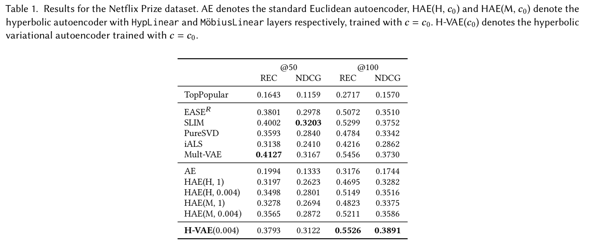
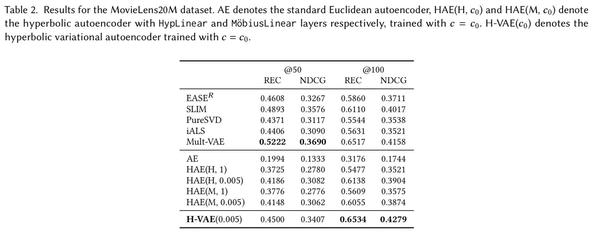
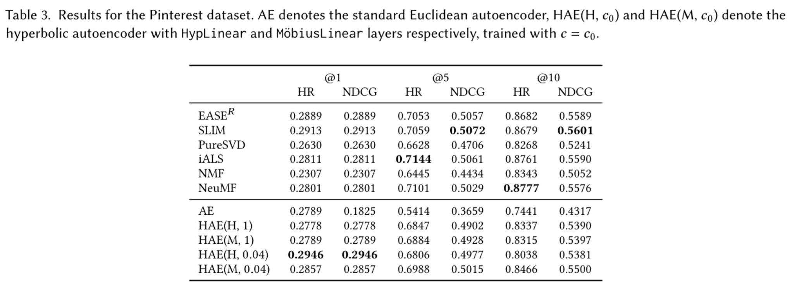
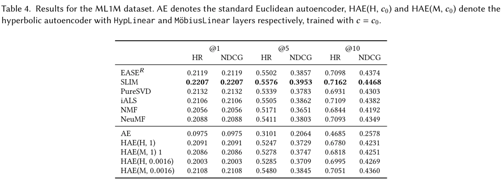

# Hyperbolic (ordinary and variational) autoencoders for recommender systems
Accompanying code for the paper [Performance of Hyperbolic Geometry Models on Top-N Recommendation Tasks]()

## Results

  
   
     
   

## Data
To reproduce our code, please put the corresponding data files in the following folder structure:

data
  * troublinganalysis
      * mvae
          * netflix
          * ml20m
      * neumf
          * ml1m
          * pinterest
  * recvae
      * ml20m

Also, please install geoopt package [geoopt](https://github.com/geoopt) for Riemannian optimization and [hyptorch](https://github.com/leymir/hyperbolic-image-embeddings) for computations in hyperbolic spaces.

## Wandb
In our experiments, we have used [wandb](http://wandb.com) framework for result tracking. Our test scripts are based on wandb configs.

## Acknowledgments
In our code we have used the following repositories:
* [mvae](https://github.com/oskopek/mvae)
* [geoopt](https://github.com/geoopt)
* [hyptorch](https://github.com/leymir/hyperbolic-image-embeddings)
